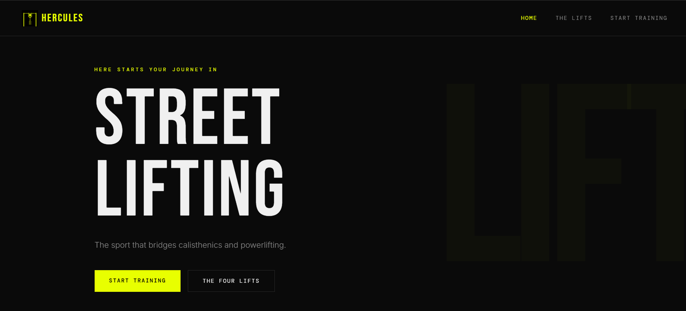
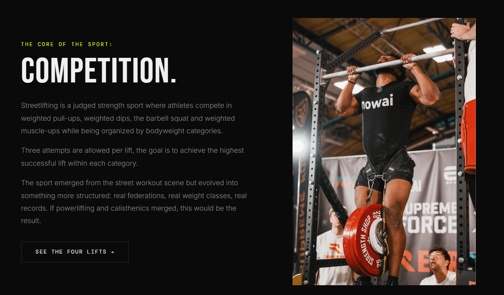
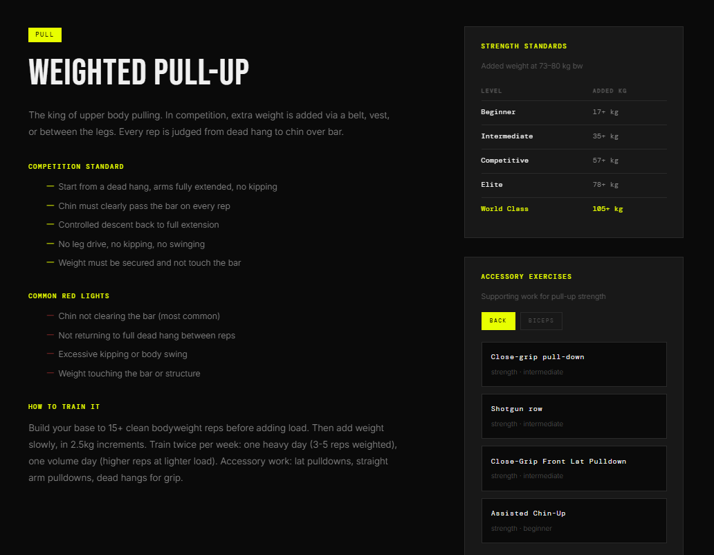
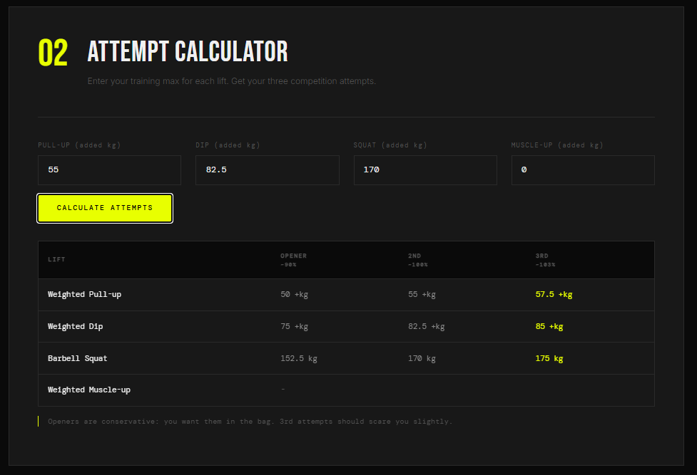
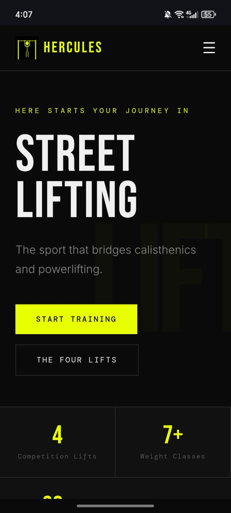
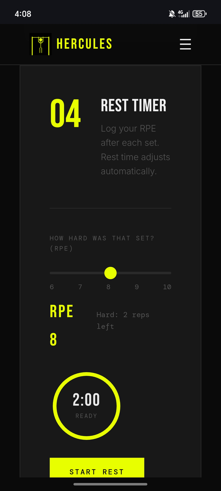
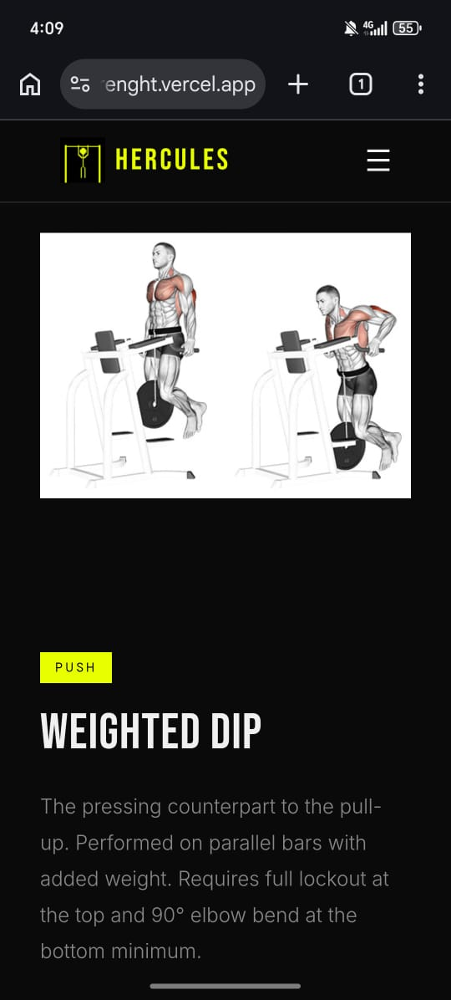

# FULL STACK PROJECT: HERCULES — Streetlifting Guide

**Student:** Marc Gedeon

**Live site:** https://hercules-strenght.vercel.app/

## API Used

**API Ninjas — Exercises API** (`https://api.api-ninjas.com/v1/exercises`)

Used on the Lifts page to pull accessory exercises for each competition lift (e.g. back/biceps exercises for the pull-up, triceps/chest for the dip). Results are filtered and fall back to a curated static list if the API call fails.

## AI Usage Appendix
**AI Tool used:** Claude

**Some of AI prompts used:**
- I want to build a website that anyone can use to get into streetlifting as a beginner. Research from Reddit to see what tools athlete use most often, and based on that recommend ideas for tools to include in this project, and output a markdown design document that we can use to start building.
- Based on the design plan, generate scaffolding for the project.
- Fill in the website with actual content instead of the Lorem Ipsum dummy texy.

**Some of what it got wrong:**
- The content Claude filled up the pages was horrible: cheesy copy and headlines, absurd numbers as records and generic explanations for each benchmarks on the lifts.
- The Warm-up generator was outputting 5+ sets by default, regardless if the input specified 50kg on a lift or 180kg+ which can be either really fatiguing without any benefits, or plain dangerous for the user.

## Project Description

HERCULES is a multi-page site for streetlifting, a strength sport combining calisthenics and powerlifting (weighted pull-ups, weighted dips, barbell squat, weighted muscle-up). It has three pages:

- **Home** — intro to the sport, a bodyweight self-assessment tool that scores the user's level based on their reps/lifts.
- **The Lifts** — tabbed breakdown of each of the four competition lifts, with competition standards, common judging faults, training guidance, strength standards by level, and live accessory exercises pulled from the API.
- **Start Training** — a dashboard of training tools: a weight class finder, a competition attempt calculator, a first-week program builder, a rest timer driven by RPE, and a warmup generator.

## Custom Requirement

**Requirement:** Create a dashboard layout with cards and dynamic updates.

**Implementation:** The Start Training page (`start.html`) contains a dashboard section built from card grids (`.dashboard-cards` / `.dash-card`, `.session-cards` / `.session-card`) driven entirely by client-side JS (`js/dashboard.js`):

- `WeightClassFinder` takes a bodyweight input and populates 5 cards (weight class, competitive standards for each lift) with a staggered fade-in animation.
- `AttemptCalculator` recomputes and re-renders an attempts table from training max inputs.
- `ProgramBuilder` generates two full training-program variants as sets of session cards, with expandable per-exercise progression schemes.
- `RestTimer` and `WarmupGenerator` render their own card-based UI and update live (countdown ring, RPE-based rest recommendation, warmup pyramid) without any page reload.

Every tool follows the same pattern: user input → recomputed data → cards re-rendered/updated in place.

## Screenshots
### Desktop

### Mobile

